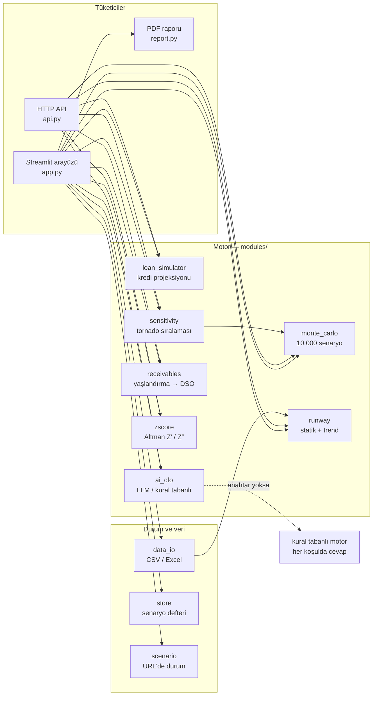

# 🛡️ Cash Guard

[](https://github.com/ealagoz233-cmd/cash-guard/actions/workflows/tests.yml)
[](LICENSE)
[](https://www.python.org/)

### ▶️ [Canlı demo: cash-guard-eren.streamlit.app](https://cash-guard-eren.streamlit.app)

Kurulum gerekmez — örnek şirket verisiyle açılır, sürgüleri oynatıp kredi
senaryosunu kendin sınayabilir, Türkçe PDF raporu indirebilirsin.

### 🔌 [Canlı API: cash-guard-api.onrender.com/docs](https://cash-guard-api.onrender.com/docs)

Aynı motor HTTP üzerinden de açık. Uçları tarayıcıdan deneyebilirsin:
[`/health`](https://cash-guard-api.onrender.com/health) ·
`/simulate` · `/sensitivity` · `/receivables` · `/zscore` · `/loan` · `/advise`
*(ücretsiz katman: servis uykudaysa ilk istek ~30 sn sürer)*

**Kurumsal Nakit Hayatta Kalma & Kredi Stres Testi Motoru**

Şirketler kârsızlıktan değil, **nakitsizlikten ve yanlış borçlanmadan** batar.
Cash Guard, bir patronun/CFO'nun en büyük korkusunu — *"acil nakit için kredi
çekeyim mi?"* sorusunu — matematiksel olarak sınar: kredinin şirketi gerçekten
kurtarıp kurtarmayacağını, yoksa sadece **"zombi şirket"** yapıp batışı birkaç ay
öteleyip ötelemeyeceğini önceden gösterir.

> Bu bir karar-destek **prototipidir (PoC)**, yatırım/finans tavsiyesi değildir.

---

## Neyi çözer?

Şirket kâğıt üstünde kârlı görünebilir ama **fiilen tahsil edilen nakit**
(collections) faturalanan gelirden düşükse, para alacaklarda sıkışır ve kasa
sessizce erir. Cash Guard tam da bu farkı temel alır ve üç açıdan saldırır:

| Modül | Soru | Yöntem |
|-------|------|--------|
| **Şirket Röntgeni** | Yapısal olarak neredeyim? | Son 12 ay gelir/tahsilat/kasa trendi, gider dağılımı, alacak yaşlandırma |
| **1 · Kredi Kurtarır mı?** | Bu krediyi çekersem ne olur? | Deterministik 24 aylık nakit projeksiyonu (annüite itfa) |
| **2 · Monte Carlo Stres Testi** | Bugünkü halimle 12 ayda batma olasılığım ne? | 10.000–50.000 rastgele ekonomik senaryo + "mevcut vs. kredili" karşılaştırma |
| **Duyarlılık (Tornado)** | Neyi düzeltirsem ne kazanırım? | Her stres sürgüsü tek tek ±5 puan oynatılıp etkiye göre sıralanır |
| **Alacak Yaşlandırma** | Bu paranın ne kadarı gerçekten gelecek? | Kova bazlı karşılık oranları, DSO, sürgülere türetilmiş gecikme profili |
| **Altman Z-Score** | Bilançom batanlarınkine benziyor mu? | Z′ (özel imalatçı) / Z″ (imalat dışı), bileşen dökümüyle |
| **3 · Acımasız CFO Ajanı** | Ne yapmalıyım? | LLM (varsa) ya da kural tabanlı, sayıya dayalı aksiyon planı + PDF rapor |

---

## Öne çıkan özellikler

- **Nakit ≠ Kâr:** Model faturalanan geliri değil, fiilen tahsil edilen nakdi
  kullanır. Alacak boşluğu ("kârlı görün, nakitsiz bat" riski) baştan görünür.
- **Borç Tuzağı Tespiti:** Kredinin iflası **öteleyip** mi yoksa **öne mi
  çektiğini** işaretli olarak ölçer. Kredili nakit eğrisi sıfırı deldiğinde
  grafik üzerine **☠ İFLAS NOKTASI** düşer.
- **Zamana Yayılan Stres:** Monte Carlo şokları 1. aydan tam güçle binmez;
  kademeli birikir (ramp). Bu hem gerçekçidir hem de batma olasılığını
  sürgülere anlamlı biçimde duyarlı tutar.
- **Devasa Batma Metriği:** "Önümüzdeki 12 ayda kasanın sıfırlanma olasılığı:
  **%94.3**" gibi tek bir gut-punch sayı.
- **Nakit Ömrü Merdiveni:** Aynı soruya üç farklı varsayımla cevap verilir ve
  aradaki uçurum gösterilir — bugünkü yakım sabit kalırsa **~42 ay**, son 12 ayın
  bozulma eğilimi sürerse **~10 ay**, Monte Carlo stresi altında beklenen
  temerrüt **8. ay**. Herkesin yaptığı "kasa ÷ yakım" hesabının neden yanılttığı
  bu merdivenin kendisidir.
- **Tornado — "Neyi Düzeltirsen Ne Kazanırsın":** Beş sürgüyü aynı anda oynatan
  kullanıcı, %94.3'ü hangisinin yaptığını göremez. Her sürgü tek tek ±5 puan
  oynatılıp diğerleri sabit tutulur, batma olasılığındaki değişim ölçülür ve
  etkiye göre sıralanır. Bütün koşular **aynı rastgele tohumu** paylaşır (ortak
  rastgele sayılar) — aksi hâlde 1 puanlık farkın parametreden mi Monte Carlo
  gürültüsünden mi geldiği ayırt edilemezdi. Etkisiz kalan sürgüler ayrıca
  "bunlarla uğraşmak zaman kaybı" diye işaretlenir.
- **Alacak Yaşlandırması Artık Sadece Grafik Değil:** Yaşlandırma tablosundan
  **DSO**, **şüpheli alacak** ("bu paranın ne kadarı hiç gelmeyecek") ve stres
  sürgülerinin **türetilmiş karşılıkları** hesaplanır; tek tıkla sürgülere
  uygulanır. Gecikme ile kayıp bilerek ayrılır: geciken para sonunda gelir,
  şüpheli alacak hiç gelmez. Yaşlandırma bakiyeyle çelişiyorsa (ör. "ortalama
  68 gün gecikmiş" derken DSO 39 gün) uygulama bunu **yutmaz, işaretler**.
- **İki Model, İki Hüküm — ve Çelişkinin Kendisi Bilgi:** Altman Z-score
  bilançoya bakıp demo şirkete **3.02, güvenli bölge** diyor; aynı anda nakit
  modeli **%94.3 batma** diyor. İkisi de doğru: Altman tahakkuk esaslı **yıllık
  bir fotoğraf** çeker, nakdin *ne zaman* geldiğini görmez. Şirketler tam olarak
  böyle batar — kârlı görünerek, nakitsiz. Uygulama bu çelişkiyi gizlemez, ekrana
  ve PDF raporuna yazar; `test_altman_says_safe_while_the_cash_model_says_ruin`
  bu anlatıyı testle kilitler.
- **Her Koşulda Çalışan CFO:** API anahtarı yoksa uygulama boş kalmaz; kural
  tabanlı yerel motor aynı acımasız üslupla, sayıya dayalı somut maddeler üretir.
- **Senaryo Karşılaştırma:** "Mevcut hal vs. kredi çekersen" iki Monte Carlo yan
  yana. Kredinin 12 ayı rahatlatıp uzun vadede iflası öne çekmesini (borç tuzağı)
  sayısal olarak gösterir.
- **Yönetim Kurulu PDF Raporu:** Yönetici özeti + kredi analizi + senaryo
  karşılaştırması + CFO aksiyon planı, tek tıkla Türkçe PDF (reportlab).
- **Kendi Verini Yükle:** Mock şirket dışında CSV/Excel ile kendi finansallarını
  yükleyebilirsin.
- **Opsiyonel Numba Hızlandırma:** Çekirdek NumPy ile zaten hızlı (20.000 senaryo
  9.4 ms); numba kuruluysa sıcak döngü JIT ile derlenip çağrı başına 1.6 ms'e
  iner — karşılığında ilk çağrıda ~0.5 sn derleme/cache maliyeti var. Her iki yol
  da testte bit-bit aynı sonucu vermek zorunda.

---

## Kurulum

```bash
# 1) Bağımlılıkları kur
pip install -r requirements.txt

# 2) Uygulamayı çalıştır
streamlit run app.py
```

Tarayıcıda `http://localhost:8501` açılır. Uygulama, paketle gelen sahte şirket
verisiyle **dolu ekran** olarak açılır — hemen deneyebilirsin.

### (Opsiyonel) Gerçek LLM CFO

Kural tabanlı motor anahtarsız çalışır. Gerçek bir LLM istiyorsan ortam
değişkeni tanımla:

```bash
# Gemini — ücretsiz katmanı var (aistudio.google.com, kart istemiyor)
export GOOGLE_API_KEY="AIza..."
# Claude — en iyi metin, ama kullandıkça ödeme; hesapta kredi olmalı
export ANTHROPIC_API_KEY="sk-ant-..."
# OpenAI
export OPENAI_API_KEY="sk-..."
```

**Paket durumu:** `anthropic` ve `google-generativeai` requirements.txt'te
açık, yani anahtarı yazman yeterli. `openai` yorumlu — kullanacaksan
`pip install "openai>=1.30"` de gerekir. (SDK'sız bir anahtar hiçbir şey
yapmaz; bu, fark edilmesi zor bir tuzak olduğu için arayüz artık söylüyor.)

Birden fazla anahtar tanımlıysa sıra Claude → OpenAI → Gemini'dir ve biri
hata verirse bir sonrakine geçilir. Rapor kutusundaki "Kaynak" rozeti
hangisinin kullanıldığını gösterir.

Hiç anahtar yoksa uygulama sessizce kural tabanlı motorda kalır — bu bir arıza
değil, halka açık demonun varsayılanı. Ama anahtar **tanımlıyken** LLM devreye
girmiyorsa rozetin altında sebebi yazar (paket eksik / anahtar geçersiz / kota
bitmiş), çünkü sessiz kalmak anahtarı ekleyen kişiyi karanlıkta bırakıyordu.

Model adları koda gömülü değil; sağlayıcılar katalog değiştirdiğinde
`CG_CLAUDE_MODEL`, `CG_OPENAI_MODEL`, `CG_GEMINI_MODEL` ile ezebilirsin.

**Streamlit Cloud'da:** uygulama ayarlarındaki **Secrets** kutusuna yaz:

```toml
GOOGLE_API_KEY = "AIza..."
```

> Anahtarı **kök seviyeye** koy. Streamlit yalnızca kök seviyedeki sırları
> ortam değişkeni olarak yayınlıyor; `[bolum]` altına koyarsan `os.getenv`
> göremez. Uygulama her iki durumu da okuyacak şekilde yazıldı, ama başka
> araçlarla uğraşmamak için kökte tutmak en sağlamı.

Anahtar eklendikten sonra rapor kutusundaki **"Kaynak"** rozeti kullanılan
sağlayıcının adını (`Gemini`, `Claude`, `OpenAI`) yazmalı. Hâlâ `Kural Tabanlı
Motor` diyorsa rozetin hemen altındaki uyarı satırı sebebini söyler — tahmin
etmene gerek yok.

---

## Deploy (Streamlit Community Cloud)

Depoyu bağlayıp `app.py`'yi ana dosya olarak seç; gerisi otomatik.

**`packages.txt` neden var:** PDF raporundaki Türkçe karakterler (ğ ı ş İ ç ö ü)
için TrueType bir font şart. Font bulunamazsa reportlab sessizce Helvetica'ya
düşer ve bu harfler bozulur — hata vermeden. Dosya `fonts-dejavu-core`
kuruyor; `modules/report.py` DejaVu'yu Linux'ta ilk aday olarak arar.

> ⚠️ `packages.txt` **yorum satırı kabul etmez.** Streamlit her satırı doğrudan
> `apt-get`'e paket adı olarak veriyor, yani `#` ile başlayan bir satır kurulumu
> komple düşürür. Sadece paket adı yaz, satır başına bir tane.

---

## Senaryo defteri

Bir CFO aracının asıl işi tek senaryo hesaplamak değil, seçenekleri
karşılaştırmaktır. Sürgüleri ayarla, senaryoyu adlandırıp kaydet, sonra
başka bir senaryo dene — ikisi tabloda yan yana durur.

**Kalıcılık bilinçli olarak kullanıcıda:** kayıtlar sunucuda tutulmaz,
istersen defteri JSON olarak indirir ve sonra geri yüklersin. İki sebep:
uygulamanın kimlik doğrulaması yok (ortak bir veritabanı herkesin analizini
herkese açardı) ve Streamlit Cloud'un diski kalıcı değil — "kaydettim" deyip
yeniden başlatmada veriyi kaybetmek, hiç kaydetmemekten kötüdür.

---

## HTTP API

**Canlı:** <https://cash-guard-api.onrender.com/docs>

Streamlit arayüzü motorun **bir** tüketicisi; aynı motor HTTP üzerinden de
kullanılabilir. Hesap mantığı kopyalanmaz — her iki yol da `modules/` altındaki
aynı kodu çağırır, böylece iki arayüz aynı şirket için farklı sayı gösteremez.
(`tests/test_api.py` bunu ölçüyor: aynı girdi, aynı çıktı.)

```bash
pip install -r requirements-api.txt
uvicorn api:app --reload
# http://localhost:8000/docs  → otomatik arayüz
```

**Dağıtım yalın tutuldu.** `requirements-api.txt` arayüz yığınını (streamlit,
plotly, reportlab) çekmez — API'nin hiçbirine ihtiyacı yok. Bu bir tercih
beyanı değil, testle korunan bir sınır: `tests/test_api.py` o paketlerin
import'unu fiilen engelleyip API'nin yine de ayağa kalktığını doğruluyor.
Sınırı korumak için saf biçimlendirme `utils/format.py`'ye alındı; `utils/theme.py`
streamlit'e bağlı olduğundan motor tarafından çağrılmaz.

**Yayına almak (Render, ücretsiz):** depoda `render.yaml` hazır. Render'da
**New → Blueprint** → bu depoyu seç → deploy. Elle ayar girmen gerekmez.
Ücretsiz katmanda servis ~15 dk trafiksiz kalınca uyur; ilk istek onu
uyandırdığı için yavaştır (`/health` bunun için ucuz bir uç).

| Uç nokta | Ne yapar |
|---|---|
| `GET /health` | Servis ayakta mı |
| `POST /simulate` | Monte Carlo: batma olasılığı, beklenen iflas ayı, nakit ömrü |
| `POST /sensitivity` | Tornado: hangi stres sürgüsü riski en çok oynatıyor (etkiye göre sıralı) |
| `POST /receivables` | Alacak yaşlandırma: DSO, şüpheli alacak, türetilmiş sürgüler |
| `POST /zscore` | Altman Z-score: bilançodan yapısal iflas riski ve bölge |
| `POST /loan` | Kredi senaryosu: taksit, toplam faiz, borç tuzağı analizi |
| `POST /advise` | Acımasız CFO aksiyon planı (LLM ya da kural tabanlı motor) |

```bash
curl -X POST http://localhost:8000/simulate \
  -H "Content-Type: application/json" \
  -d '{"current_cash":4200000,"monthly_revenue":6800000,"monthly_fixed_expense":5950000}'
```

> Girdiler doğrulanır ve Monte Carlo iterasyon sayısı 50.000 ile sınırlıdır.
> Servis dışarı açılırsa girdiler güvenilmezdir; sınırsız iterasyon tek bir
> istekle sunucunun CPU'sunu tüketmeye davetiye olurdu. `/sensitivity` tek
> istekte ~11 simülasyon koştuğu için tavanı bilerek daha düşük (20.000).
>
> `/simulate` varsayılanları motorun kendi varsayılanlarıdır; arayüzdeki
> sürgülerin başlangıç değerleriyle birebir aynı değildir. Aynı sonucu
> istiyorsan stres parametrelerini istekte açıkça gönder.

---

## Kendi verini yükleme biçimleri

Sidebar'daki yükleyici iki biçim kabul eder:

**Biçim A — Anahtar/Değer (`alan,deger`):** Çekirdek skalerleri ezer.

```csv
alan,deger
current_cash,4200000
avg_monthly_revenue,7200000
avg_monthly_collections,6800000
avg_monthly_fixed_expense,5950000
existing_monthly_debt_service,950000
```

**Biçim B — Aylık geçmiş tablosu:** Ortalamalar ve son kasa buradan türetilir.

```csv
month,revenue,fixed_expense,collections,cash_end
2026-01,6540000,5900000,5700000,5720000
...
```

### Excel'den çıkan dosyalar

Türkçe Excel CSV'yi **noktalı virgülle** ve **cp1254** kodlamasıyla yazar
(virgül ondalık ayırıcı olduğu için). Yükleyici bunu kendisi çözer — ayırıcı
olarak virgül, noktalı virgül veya sekme; kodlama olarak UTF-8 (BOM'lu dahil)
veya cp1254 kabul edilir.

Sayılar da Türkçe biçimde yazılabilir: `5.000.000`, `5.000.000,50`, `₺1.200`
hepsi doğru okunur. Bir değer yine de çevrilemezse **sessizce geçilmez** —
sidebar'da hangi alanların atlandığı uyarı olarak gösterilir, çünkü o alanda
örnek şirketin rakamı kalır ve fark edilmemesi tehlikelidir.

---

## Proje mimarisi

Tek bir hesap motoru, üç ayrı tüketici. Mantık hiçbir yerde kopyalanmaz —
kopyalanan mantık er geç ayrışır ve iki arayüz aynı şirket için farklı sayı
gösterir. `test_api_and_engine_agree` bunu bekçilikle korur.



Arayüz bağımlılığı motora sızmaz: `utils/theme.py` streamlit'e bağlıdır ve
motordan çağrılmaz; ortak biçimlendirme `utils/format.py`'dedir. Bu sayede API
dağıtımı arayüz yığınını kurmak zorunda kalmaz (testle korunur).

```
cash-guard/
├── app.py                       # Ana Streamlit arayüzü (dashboard)
├── api.py                       # HTTP API (FastAPI) — motorun ikinci tüketicisi
├── render.yaml                  # Render Blueprint: API'yi tek tıkla yayına al
├── modules/
│   ├── loan_simulator.py        # Modül 1: deterministik kredi/borç projeksiyonu
│   ├── monte_carlo.py           # Modül 2: 10.000+ iterasyon stres testi
│   ├── sensitivity.py           # Tornado: hangi sürgü riski en çok oynatıyor
│   ├── receivables.py           # Alacak yaşlandırma → DSO, şüpheli alacak, sürgüler
│   ├── zscore.py                # Altman Z′/Z″ — bilançodan yapısal iflas riski
│   ├── ai_cfo.py                # Modül 3: LLM + kural tabanlı CFO ajanı
│   ├── runway.py                # Nakit ömrü: statik + trend (Theil–Sen) hesabı
│   ├── data_io.py               # Veri yükleme ve kullanıcı CSV/Excel ayrıştırma
│   ├── store.py                 # Senaryo defteri: kaydet/karşılaştır/dışa aktar
│   ├── scenario.py              # Durumu URL'de taşıma (paylaşılabilir link)
│   └── report.py                # Yönetim kurulu PDF raporu (reportlab)
├── utils/
│   ├── format.py                # Arayüzden bağımsız biçimlendirme (motor kullanır)
│   ├── theme.py                 # "War-room" karanlık tema, KPI kartları, CSS
│   └── performance_utils.py     # Numba/NumPy nakit yolu çekirdeği
├── tests/                       # 168 test, 13 dosya
│   ├── test_finance_math.py     # Kredi matematiği + Monte Carlo değişmezleri
│   ├── test_runway.py           # Statik/trend runway, Theil–Sen dayanıklılığı
│   ├── test_data_integrity.py   # Mock veri tutarlılığı + yükleme dayanıklılığı
│   ├── test_report.py           # PDF üretimi, font ve para birimi kararı
│   ├── test_ai_cfo.py           # Sağlayıcı seçimi, fallback, teşhis, sızıntı
│   ├── test_store.py            # Defter sözleşmesi: kayıp yok, bozuk dosya çökertmez
│   ├── test_sensitivity.py      # Tornado sıralaması, sınır uyumu, ekonomik yön
│   ├── test_receivables.py      # Kova sınırları, şüpheli alacak, veri tutarsızlığı
│   ├── test_zscore.py           # Altman katsayıları, bölgeler, eksik veri, tez kilidi
│   ├── test_scenario.py         # URL'de taşınan senaryonun dayanıklılığı
│   ├── test_api.py              # HTTP uçları + motorla aynı sayıyı verdiği
│   ├── test_app_wiring.py       # Arayüz kablolaması (Streamlit AppTest)
│   └── test_docs.py             # README'nin verdiği sayılar bayatlamasın
├── data/
│   └── mock_company_data.json   # Uygulama boş açılmasın diye sahte şirket
├── .streamlit/config.toml       # Karanlık tema temel ayarları
├── requirements.txt             # Streamlit dağıtımı
├── requirements-api.txt         # API dağıtımı (arayüz yığını YOK)
└── README.md
```

> `data_io.py` bilerek `app.py`'den ayrıdır: `app.py` bir Streamlit script'i
> olduğu için import edilemez, dolayısıyla içindeki kod test edilemezdi.

### Model notları (metodoloji)

- **Nakit girişi = tahsilat (collections)**, faturalanan gelir değil. Aradaki
  fark alacaklarda birikir.
- **Kredi taksidi:** Eşit taksitli (annüite) formül
  `A = P·r·(1+r)ⁿ / ((1+r)ⁿ−1)`; ek taksit yalnızca vade boyunca eklenir.
- **Temerrüt tanımı:** Nakit yolu herhangi bir ayda sıfırın altına düşerse o
  senaryo "batmış" sayılır (path-dependent — sonradan toparlanma da doğru
  işlenir).
- **Stres değişkenleri:** Gelir düşüşü, tahsilat gecikmesi (nakit kayması),
  gider artışı ve piyasa oynaklığı; hepsi zamana yayılan rampayla uygulanır.
- **Altman Z-score:** Katsayılar yayımlanmış modellerden birebir alınmıştır;
  yeniden kestirilmiş ya da "iyileştirilmiş" bir sürüm yoktur. Sektörde
  üretim/imalat ibaresi varsa **Z′ (1983, özel imalatçı)**, aksi hâlde **Z″
  (imalat dışı / gelişmekte olan piyasa)** seçilir. Orijinal 1968 Z-score hiç
  uygulanmadı: X4 için özkaynağın *piyasa* değerini ister ve bu uygulamanın
  kullanıcısı özel şirket — piyasa değeri yerine defter değeri koyup "Z-score
  hesapladım" demek, modelin kalibre edildiği büyüklüğü değiştirmek olurdu.
  Eksik veride skor **üretilmez**: yarım veriyle hesaplanmış bir iflas skoru,
  hiç skor olmamasından tehlikelidir. Borçsuz şirkette X4 tanımsız olduğu için
  sonlu bir tavana (10) oturtulur — borçsuzluk sağlıklıdır ama diğer üç bileşeni
  anlamsızlaştırmamalı.
- **Alacak yaşlandırma:** Kovalar 30/60/90 gün sınırlarıyla ayrılır; her kovaya
  yerleşik bir karşılık oranı (vadesinde %2 → 90+ gün %50) ve beklenen tahsil
  gecikmesi (1–4 ay) atanır. Bunlar doğa yasası değil, kabul görmüş bir başlangıç
  noktasıdır ve `DEFAULT_BUCKETS` ile değiştirilir. **DSO** = bakiye ÷ aylık
  faturalanan gelir × 30. Sürgülere bağlanma noktası tek bir büyüklüktür:
  simülasyonda bir ayın tahsilatından kayan beklenen oran `delay_prob ×
  delay_severity` çarpımıdır; yaşlandırma tarafındaki karşılığı gelecek aydan
  sonraya sarkması beklenen paydır. İki taraf bu çarpımda buluşur. Türetilen
  değerler sürgülerin yerine **otomatik geçmez** — yaşlandırma verisi çoğu
  şirkette eksik ya da tutarsızdır ve sessizce uygulanan bir varsayım,
  kullanıcının göremediği bir varsayımdır.
- **Yaşlandırma–bakiye çelişkisi:** Yaşlandırma "ortalama N gün gecikmiş" diyorsa
  alacaklar defterde ortalama en az N gün beklemiştir, dolayısıyla DSO ≥ N
  olmalıdır (vade süresi bunun üstüne biner). DSO daha küçük çıkıyorsa ikisi aynı
  anda doğru olamaz. Eşitsizlik vade süresi hakkında hiçbir varsayım yapmaz —
  bilinmeyen bir sayıyı tahmin etmek yerine onsuz da geçerli olan alt sınır
  kullanılır. Demo verisi bu kontrolü **fiilen tetikliyor** (68 gün vs. 39 gün)
  ve bu, kontrolün eklenmesiyle ortaya çıkan gerçek bir tutarsızlık: örnek
  şirketin yaşlandırma listesi ile alacak bakiyesi birbirini tutmuyor. Veriyi
  sessizce düzeltip uyarıyı susturmak yerine ekranda bırakıldı — gerçek
  yüklemelerde en sık karşılaşılan hata tam olarak bu ve uygulamanın buna nasıl
  davrandığı görünmeli.
- **Duyarlılık:** Tek değişkenli yerel duyarlılık (one-at-a-time). Her sürgü
  sırayla ±5 puan oynatılır, diğerleri sabit tutulur; iki uç arasındaki batma
  olasılığı farkı ("swing") o sürgünün etkisidir. **Ortak rastgele sayılar**
  şart: 10.000 iterasyonda Monte Carlo'nun kendi standart hatası zaten ~0.5
  puan, tohum değişseydi swing'in gürültüden ayrılması mümkün olmazdı. Sürgü
  sınırına yakın bir tabanda ±5 puan simetrik uygulanamaz; kırpılır ve sonuç
  **fiilen kullanılan** uç değeri taşır.
- **Oynaklığın ters etkisi:** Taban senaryo derin zarardayken oynaklığı
  artırmak batma olasılığını *düşürebilir* — bu bir hata değil. Kasa suyun çok
  altındaysa dalga boyu büyüdükçe yüzeye çıkan senaryo sayısı artar (opsiyon
  benzeri getiri). Arayüz bu durumu yakalayıp ayrıca açıklar, çünkü açıklanmadan
  gösterilen ters yönlü bir bar "model bozuk" izlenimi verir.
- **Nakit ömrü:** Statik runway = kasa ÷ aylık yakım. Trend runway ise geçmiş
  faaliyet nakdine doğrusal bir eğilim uydurup ileri uzatır. Eğim, en küçük
  kareler yerine **Theil–Sen** (ikili eğimlerin medyanı) ile kestirilir: 12
  gözlemde tek bir anormal ay (toplu tahsilat, tek seferlik gider) en küçük
  kareleri belirgin biçimde çarpıtıyor — demo verisinde gerçek eğilim
  −28.100 ₺/ay iken en küçük kareler −40.552 ₺/ay veriyor, Theil–Sen ise
  −28.211 ₺/ay ile doğru sonucu buluyor.

---

## Testler

```bash
python -m pytest tests/ -q          # pytest ile
python tests/test_finance_math.py   # ya da tek tek, bağımlılıksız
```

**168 test**, on üç dosyada:

| Dosya | Neyi korur |
|-------|-----------|
| `test_data_integrity.py` (21) | Mock verinin ortalamalarının skalerlerle birebir tutması, kasa yürüyüşünün sapmasız olması, eksik sütunlu CSV'nin uygulamayı çökertmemesi, Türkçe/Excel biçimlerinin okunması, Türkçe etiketler |
| `test_finance_math.py` (19) | Annüite formülü elle hesaplanmış değerle; itfa tablosunda anapara toplamı = kredi ve vade sonu bakiye = 0; Monte Carlo değişmezleri (olasılık aralığı, tohum tekrarlanabilirliği, yüzdelik bantların sıralaması, "stres artınca batma olasılığı düşemez"); **vektörize çekirdeğin naif referans döngüyle birebir eşitliği** |
| `test_app_wiring.py` (14) | Arayüz kablolaması: Streamlit `AppTest` ile uçtan uca kaydetme, geri yükleme ve paylaşılabilir link akışı |
| `test_ai_cfo.py` (13) | Sağlayıcı sırası ve hataya karşı bir sonrakine geçiş, anahtarsız kural tabanlı motora düşüş, teşhis mesajı, anahtarın çıktıya sızmaması |
| `test_report.py` (12) | PDF gerçekten üretiliyor mu, Türkçe karakter için font seçimi ve para birimi kararı |
| `test_api.py` (15) | HTTP uçlarının sözleşmesi, girdi doğrulama ve iterasyon tavanı, **API'nin motorla aynı sayıyı vermesi**, arayüz yığını import edilemezken bile ayağa kalkması |
| `test_store.py` (9) | Senaryo defteri sözleşmesi: kayıt kaybolmaz, bozuk JSON uygulamayı çökertmez |
| `test_runway.py` (8) | Statik/trend runway ayrışması, Theil–Sen'in aykırı değere dayanıklılığı, yetersiz veride güvenli geri çekilme |
| `test_zscore.py` (18) | Altman katsayılarının ve bölge eşiklerinin elle hesaplanmış değerlerle uyumu, model seçimi, eksik veride skor ÜRETMEME, borçsuz şirkette sonsuza kaçmama, "Altman güvenli der / nakit batıyor der" tezinin kilitlenmesi |
| `test_receivables.py` (17) | Kova sınırlarının etiketleriyle uyumu, şüpheli alacak aritmetiği, DSO, bakiye ile yaşlandırmanın çelişkisinin yakalanması, türetilmiş sürgülerin ölçülen kaymayı vermesi, bozuk veride çökmeme |
| `test_sensitivity.py` (12) | Tornado sıralaması, sürgü sınırlarının arayüzle uyumu, ortak rastgele sayıların korunması, ekonomik yönün doğruluğu, sınırda kırpma dürüstlüğü |
| `test_scenario.py` (7) | URL'de taşınan senaryonun tur gidiş-dönüşü, bozuk/eksik parametrede varsayılana düşme |
| `test_docs.py` (3) | README'nin kendi hakkında verdiği test sayılarının bayatlamaması |

En kritik test `test_vectorized_kernel_matches_reference`: Monte Carlo çekirdeği
performans için `cumsum`/`argmax` hilesi kullanır ve bu hile sessizce yanlış
olabilir. Test onu okunması kolay, optimize edilmemiş bir referans döngüyle
karşılaştırır ve veri kümesinin **batıp sonradan toparlanan** senaryolar
içerdiğini ayrıca doğrular — optimizasyonun kırılabileceği tek yer orasıdır.

> ⚠️ Sayısal varsayımlar örnektir; kararlarını yalnızca bu prototipe dayandırma.
> Amaç, riski görünür kılıp doğru soruları sordurmaktır.

---

## Yol haritası (gelecek)

- Muhasebe/ERP entegrasyonu (API ile canlı veri)
- Kullanıcı kimlik doğrulama ve şirket bazlı veri izolasyonu
- Ağır simülasyonlar için arka plan işçisi (Celery/Redis) ve senaryo kaydetme
- Alacak yaşlandırmasının fatura BAZINDA beslenmesi (şu an kova ortalamasıyla;
  müşteri başına ayrı DSO varsayımı değil)
